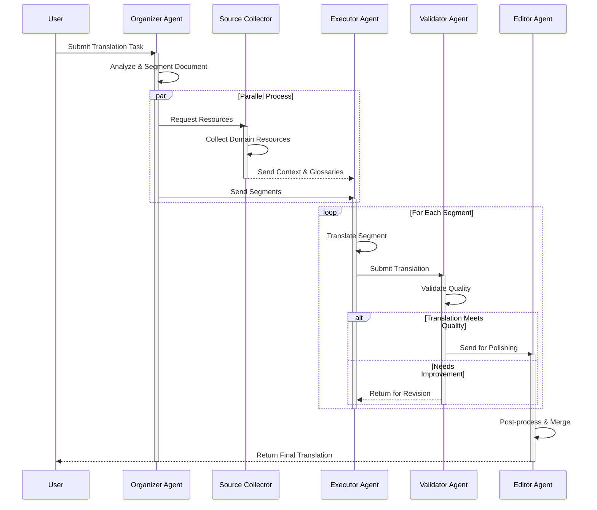
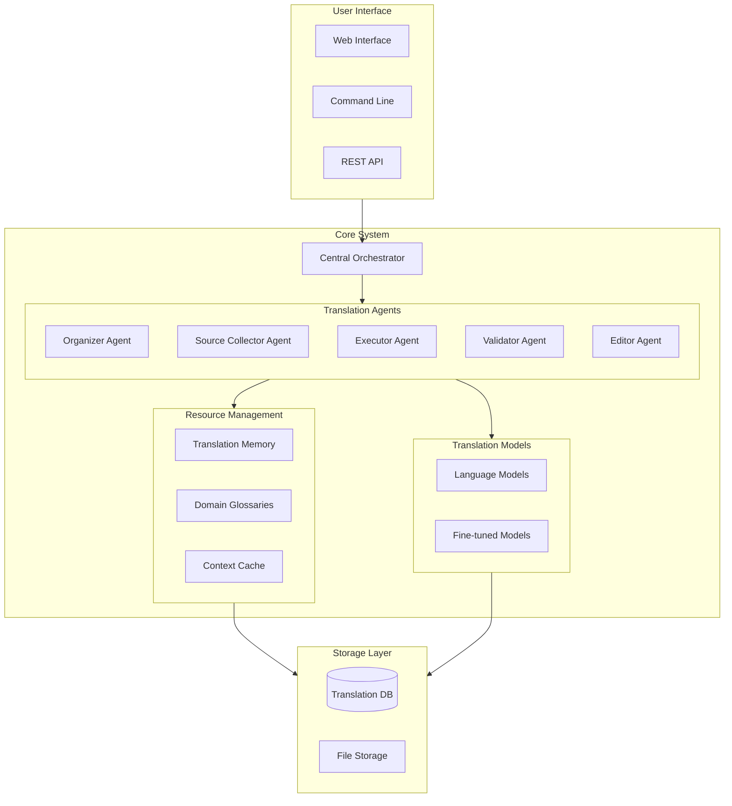

# OpenTranslator

**OpenTranslator** is an open‑source, multi‑agent translation framework designed to autonomously translate websites, documents, PDFs, and more between any source and target languages—with an initial focus on Bengali. Our unique agent‑based design decomposes complex translation tasks into specialized sub‑agents that collaborate to ensure context‑preserving and high‑quality output.

## 🔄 Translation Workflow



## 🏗️ System Architecture



## 🤖 Agent Framework Overview

The OpenTranslator system is composed of five primary agents. Each agent specializes in a key part of the translation pipeline and communicates through a central orchestrator that coordinates their interactions.

### 1. Translator Organizer Agent
- **Role:**  
  - Receives the user's task request (e.g., "Translate the book *Great Expectations* to Bengali").
  - Analyzes the document to determine structure, context, and segmentation strategy.
- **Responsibilities:**  
  - **Task Analysis:** Parse the user's input to determine task parameters (source/target language, style guidelines, domain constraints).
  - **Segmentation:** Divide large documents or web pages into manageable segments while preserving context boundaries.
- **Interaction:**  
  - Sends segmented text along with task parameters to the Translator Executor Agent.
  - Informs the Source Collector Agent about the context and any domain-specific needs (e.g., glossary lookups).

### 2. Translator Source Collector Agent
- **Role:**  
  - Collects supporting resources to enhance translation quality.
- **Responsibilities:**  
  - **Resource Gathering:** Retrieve domain-specific glossaries, translation memories, bilingual corpora, or user-provided references.
  - **Context Augmentation:** Append relevant reference materials to each text segment to guide the translation.
- **Interaction:**  
  - Shares the collected resources with the Translator Executor and Validator Agents to improve accuracy and consistency.

### 3. Translator Executor Agent
- **Role:**  
  - Performs the core translation.
- **Responsibilities:**  
  - **Translation Execution:** Use state‑of‑the‑art language models (e.g., a fine‑tuned GPT‑4 variant for Bengali) to translate each segment.
  - **Context Management:** Maintain a shared memory of previous segments to ensure terminology and style consistency.
- **Interaction:**  
  - Receives segmented text and reference context from the Organizer and Source Collector Agents.
  - Forwards translated segments to the Validator Agent for quality checking.

### 4. Translator Validator Agent
- **Role:**  
  - Assesses translation quality and consistency.
- **Responsibilities:**  
  - **Quality Evaluation:** Apply automated evaluation metrics (such as BLEU score, back‑translation checks, or custom validation rules) to determine if a segment meets quality thresholds.
  - **Error Flagging:** Mark segments that need revision or re‑translation.
- **Interaction:**  
  - Returns flagged segments to the Executor Agent for re‑processing or sends them to the Editor Agent for refinement.
  - Provides feedback to the Organizer Agent for potential re‑segmentation if contextual issues are found.

### 5. Translator Editor Agent
- **Role:**  
  - Post‑processes and refines translations.
- **Responsibilities:**  
  - **Polishing:** Correct minor grammatical errors, adjust style and tone, and merge segmented translations into a cohesive final document.
  - **User Interaction:** Offer an interactive chat interface for human-in‑the‑loop corrections when needed.
- **Interaction:**  
  - Combines validated segments into the final output.
  - Notifies the user if manual intervention is recommended.

## 🚀 Quick Start

### Installation

Clone the repository and install dependencies:

```bash
git clone https://github.com/OpenTranslator/Open-Translator.git
cd Open-Translator
pip install -r requirements.txt
```

### Setup Environment Variables
```bash
export OPENAI_API_KEY=your_key_here
```

### Usage
## Run a translation

```python
from opentranslator import TranslationCrew

crew = TranslationCrew()
result = crew.crew().kickoff(inputs={
    "source_language": "en",
    "target_language": "bn",
    "domain": "literary",
    "document_path": "my_document.pdf"
})
```

## Run the translator from the command line
## Basic ssage
```bash
python translator.py --task "Translate the book 'Great Expectations' into Bengali" --src-lang en --tgt-lang bn --apikey YOUR_API_KEY
```
## With advanced options

```python
python translator.py \
    --task "Translate the technical document" \
    --src-lang en \
    --tgt-lang bn \
    --input-file docs/manual.pdf \
    --output-dir output/translations \
    --domain technical \
    --verbose
```
For interactive use or to adjust agent parameters, please refer to our [User Guide](docs/USER_GUIDE.md).

## 📚 Example Use Cases

- **Literary Translation:**  
  A user wants to translate a classic novel into Bengali. The Organizer segments the book by chapters, the Source Collector retrieves literary glossaries and past translations, and the Executor translates each chapter. The Validator ensures narrative consistency, while the Editor smooths out stylistic issues, producing a coherent translation suitable for publication.

- **Financial or Consensus Documents:**  
  For sensitive reports or legal documents, the agents can be configured with stricter validation rules. The Organizer breaks down the document, the Source Collector fetches domain-specific terminology and regulations, and the Executor performs a precise translation. The Validator applies rigorous quality checks and, if necessary, flags parts for human review via the Editor, ensuring an accurate and compliant translation.

## 🤝 Contributing

We welcome community contributions to enhance agent behaviors, improve quality metrics, and add support for additional languages. Please see [Contributing Guidelines](CONTRIBUTING.md) for more details.

## 📄 License

OpenTranslator is released under the [MIT License](LICENSE).

## 🙏 Acknowledgments

Inspired by innovative multi‑agent frameworks such as [MetaGPT](https://github.com/geekan/MetaGPT) and [AutoGen](https://github.com/microsoft/autogen), OpenTranslator aims to democratize high‑quality translation—leaving no language behind.